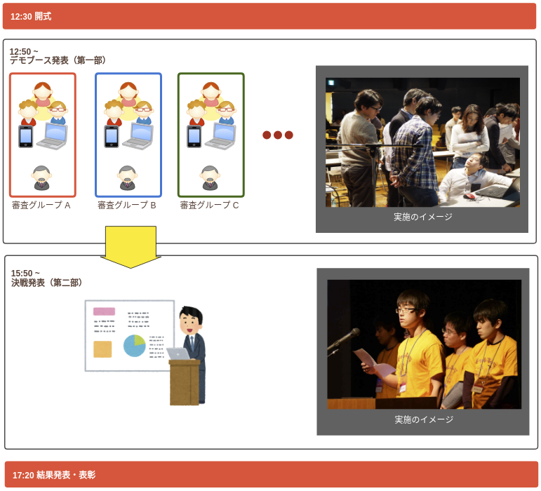
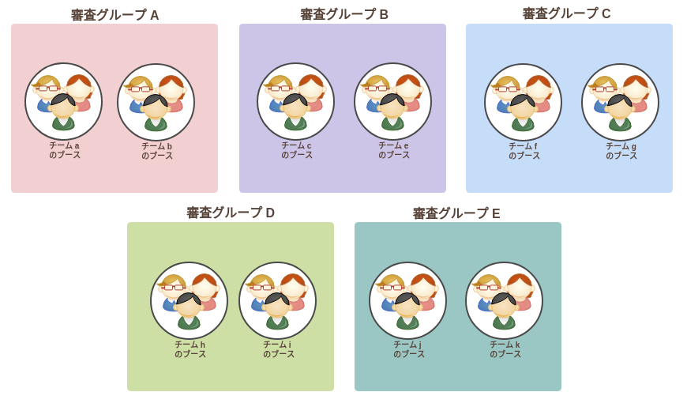

# この資料について

チャレキャラのコンテストにて、
学生の皆さんが作品発表（プレゼンテーション）を実施するための方法を
まとめたものです。

# 対象

チャレキャラ参加学生

# コンテスト全体の流れ

12:30 の開式後、皆さんに関係する発表は２つあります。

- デモブース発表
- 決勝発表

以下のイメージをご覧ください。

 **「デモブース発表」**

コンテストに申し込んだすべての学生が参加します。
学生チームは自分に割り当てられたグループにある自分のブースに移動して、
そこで審査員による個別の作品審査を受けます。
学生の皆さんは自分のパソコンとデモ機を使って、審査員に作品をアピールしてください。

この作品審査の結果をもって、「決戦発表」のチームが選抜されます。

 **「決戦発表」**

選抜１０チームによる決戦発表となります。
決戦発表は、中央の大スクリーンを使ってのプレゼンテーションとなります。

# 「デモブース発表」について

「デモブース発表」では、審査員が皆さんの作品選考を行います。

会場を５グループ（審査グループA ~ 審査グループE）に分割します。
学生の皆さんは、配置されたグループに移動して、自分たちのブースにて、作品審査の準備をお願いします。

  

## 審査グループ分け

これは当日の配布資料にも記載しますが、こちらでも事前にお知らせしておきます。

| グループ名 | チーム | 担当メンター |
| --- | --- | --- |
| 審査グループ A | `プロジェクトJUN`, `ヒミツの話題工房`, `はみがきたぬき`, `ぱっ見`, `伝説の最先端`, `Amii`, `でぷろい` | 小野 (おの) |
| 審査グループ B | `ko.py`, `ラーメンまであと３分`, `teamC`, `限界高専生と愉快な仲間たち`, `Movie De Historia`, `ブロドラ`, `虚無スター`, `proglife` | 野村 (のむら) |
| 審査グループ C | `Gaze製作委員会`, `ケ・セラ・セラ`, `Only Cityズ`, `NullPointerException`, `タイガーマスク`, `V-JET α`, `ETC`, `Passtick` | 前田 (まえだ) |
| 審査グループ D | `天和`, `卵は黄身派`, `SSS`, `カルピス`, `書きこMeets`, `後でだるま行きます`, `ひまんちゅ`, `すねいく` | 新福 (しんぷく) |
| 審査グループ E | `wakaba`, `ers'`, `;`, `やるしかない`, `焼肉奉行`, `Hello, K-Lab!`, `Bitpickers`, `チーム刑部` | 瓦田 (かわらだ) |

## 「デモブース発表」の進行について

「デモブース発表」は約２時間 (開始 12:50 の 終了 14:50) に渡って行われます。

各グループには審査員が２、３名おります。
**審査員が自分たちのブースに来たら、作品のプレゼンテーションを開始してください**。
審査員は、他のチームの審査もあるため、審査のためのプレゼンテーションは**８分程度を目安**としてください。

それぞれのブースには、審査員の他にもメンターや来賓、来場者もやってきます。
審査員のいない時間は、そういった方々に自分たちの作品を見てもらう時間としてください。

## 審査の方法

各チーム、各個人の審査員による選考時間は約８分程度となります。
審査員が自分たちのブースにやってきたら、概ね次のように進行していただければと思います。

| 順番 | 時間目安 | 内容 |
| --- | --- | --- |
| 1 | 5分 | プレゼンテーション（ノートパソコンに写す） |
| 2 | 3分 | 実機デモ、質疑応答 |

## 1. プレゼンテーション

自分のノートパソコンにプレゼン資料（PowerPoint や Keynote などで作成したもの）を映して、
チャレキャラで制作したアプリのプレゼンテーションを行なってください。

**これは決戦発表で使用する予定のプレゼンテーションと同じ内容で構いません。**

## 2. 実機デモ、質疑応答

自分たちが制作したアプリを、審査員に触ってもらう時間です。

ここでトラブルが発生して、アプリが動かないということは、よくありがちです。

会場には Wi-Fi が準備されていますので、
Wi-Fi がちゃんと繋がっているかどうかを確認しておきましょう。
アプリが問題なく動作しているかも、
事前に必ず確認してから「デモブース発表」に臨みましょう！！

ここで失敗するのは、本当にもったいないです！(´；ω；｀)

# 「決戦発表」の構成について

**「デモブース発表」からの選抜１０チームによる決戦発表です！**
各チーム、各個人の持ち時間は５分となります。

| 順番 | 時間目安 | 内容 |
| --- | --- | --- |
| 1 | 5分 | プレゼンテーション |

## 1. プレゼンテーション

壇上にて、中央の大スクリーンを使ってのプレゼンテーションとなります。

プレゼンテーションの内容は「デモブース発表」と同じ構成で構いません。

目の前にする審査員の数、企業の数、学生の数が段違いとなります！
選抜されたという自信を持って、半年間の努力の結晶を全力でアピールしてください！！(ﾟＡﾟ;)

# （重要）プレゼン資料の注意点

プレゼン資料は PowerPoint や Keynote などのプレゼンテーションソフトを利用して作成してください。
プレゼン資料を投影するためのノートパソコンも、忘れずにコンテストへ持参をお願いします。

**アスペクト比**

- 16:9

**コネクタ**

- HDMI
- D-sub
- USB type-C (MacBook Pro など)

これらは会場にて用意しております。
この一覧にない接続形式を利用する場合、必ず変換アダプタを持参してください！

**音声出力**

HDMI 接続の場合は、そこから音声出力することが出来ます。
それ以外の場合、ステレオミニプラグを用意しておりますので、そちらに接続してください。

音量は、中央管理のため操作できません。
